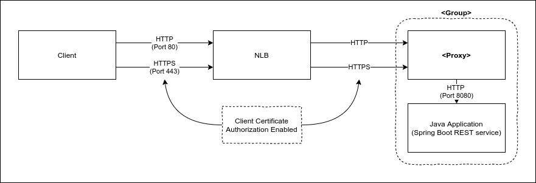

# Sample mTLS demo application

This project aims to demonstrate how to deploy a mTLS application onto AWS Cloud. It deploys the same application 3 times, using different approaches:

- Using [Envoy](https://www.envoyproxy.io) as a side car for TLS handling, on EKS and EC2
- Using an [NGINX Ingress controller](https://github.com/kubernetes/ingress-nginx) on EKS

## Architecture

The high level diagram bellow illustrates the 3 different approaches; The difference between them lies on the ***&lt;group&gt;***  and ***&lt;proxy&gt;*** items

### Envoy@EKS
- Group: Is a Kubernetes Pod
- Proxy: Envoy, configured as a sidecar within the Pod. 

### Envoy@EC2
- Group: Is a [service shared network](https://docs.docker.com/compose/compose-file/#network_mode), created by docker-compose
- Proxy: Envoy, configured as the shared network 

### NGINX Ingress Controller@EKS
- Group: Is a Kubernetes Pod
- Proxy: Kubernetes' Ingress Controller, implemented with NGINX

## Pre-Requisites
In order to build and deploy this demo you'll need the following tools:

- Build
	- Java SDK 8
	- Maven
	- Docker
	- Docker Compose
	- OpenSSL  

- Deploy
	- **Configured** AWS cli
	- Python 3.6+
	- OpenSSL
	- AWS CDK

## Building and Deploying

### Generating the certificate files

There's a helper script [generate-certs.sh](generate-certs.sh) on the root folder of the project. You'll need those certs for either building the Envoy docker image, or deploying the solution. **This is a mandatory step**
&nbsp;  

### Building
You don't need to build the docker images (envoy and web) for deploying this solution, as they are already deployed onto Docker hub. But, if you want to do that, there's a helper script [build.sh](build.sh) for it. 

### Deploying the solution

This solution adopts the *Infrastructure as Code* paradigm, and was built using AWS CDK. You can see the source code inside the [cdk](cdk) folder. The following files were created, for deploying:

- [app.py](cdk/app.py): Base infrastructure stack (VPC and related components)
- [ec2.py](cdk/ec2.py): Envoy@EC2 stack
- [eks.py](cdk/eks.py): EKS Cluster
- [envoy.py](cdk/envoy.py): Envoy@EKS stack
- [ingress.py](cdk/ingres.py): Ingress@EKS stack

There's a helper [deploy.sh](deploy.sh) script on the root folder of this project to execute all the necessary steps for deploying this solution onto AWS Cloud. 

If you're deploying using the image from Docker Hub, you can download the client certificates from [here](static/client-certificates.zip)